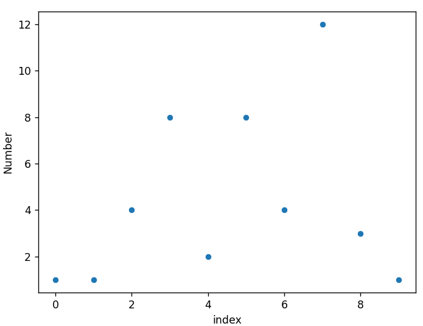
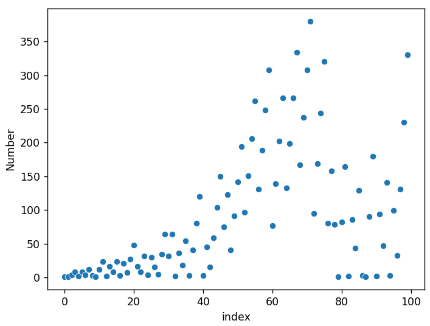
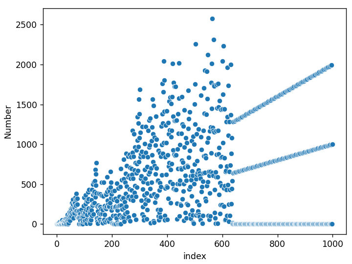
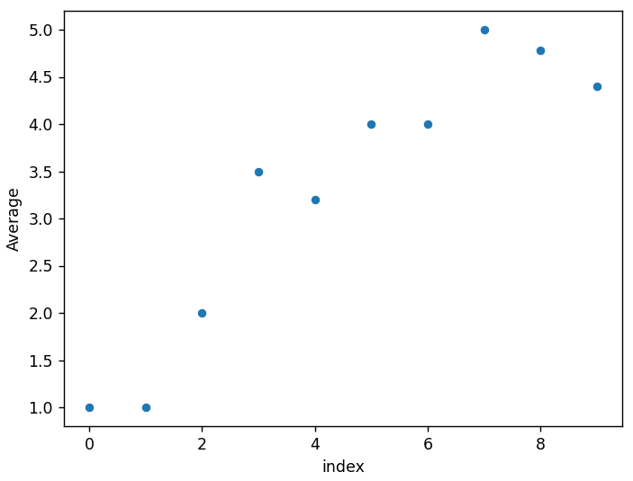
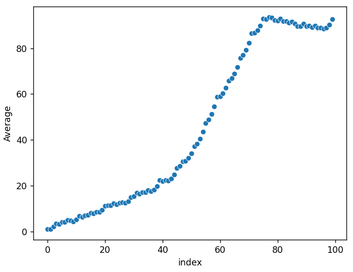
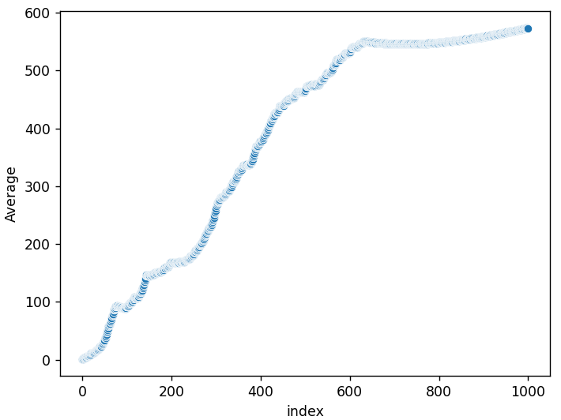
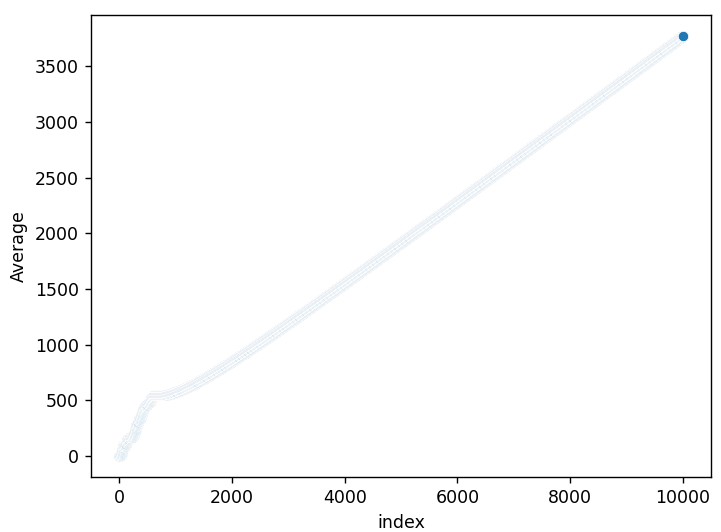
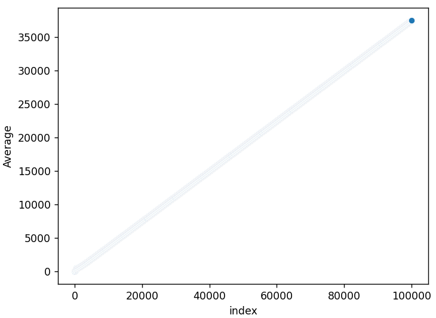

# fly-straight-sequence
This script generates the [Fly-Straight sequence](https://www.youtube.com/watch?v=pAMgUB51XZA). 

output: `[1, 1, 4, 8, 2, 8, 4, 12, 3, 1, 12, 24, 2, 16, 8, 24, 3, 21, 7, 27]`

# Plotting with Seaborn
## Basic Scatterplots
Scatterplot of 10 numbers:

Scatterplot of 100 numbers:

Scatterplot of 1000 numbers:

## Plotting the Average as $n \to \infty$
Scatterplot of the first 10 averages:

Scatterplot of the first 100 averages:

Scatterplot of the first 1,000 averages:

Scatterplot of the first 10,000 averages:

Scatterplot of the first 100,000 averages:
