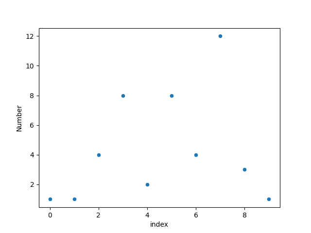
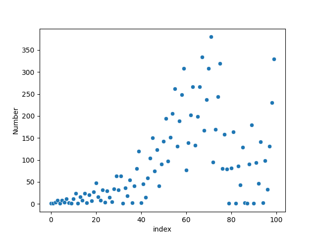
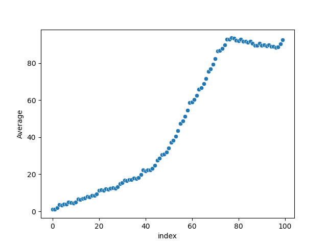

# fly-straight-sequence
This script generates the [Fly-Straight sequence](https://www.youtube.com/watch?v=pAMgUB51XZA). 

output: `[1, 1, 4, 8, 2, 8, 4, 12, 3, 1, 12, 24, 2, 16, 8, 24, 3, 21, 7, 27, 48, 16, 8, 32, 4, 30, 15, 5, 34, 64, 32, 64, 2, 36, 18, 54, 3, 41, 80, 120, 3, 45, 15, 59, 104, 150, 75, 123, 41, 91, 142, 194, 97, 151, 206, 262, 131, 189, 248, 308, 77, 139, 202, 266, 133, 199, 266, 334, 167, 237, 308, 380, 95, 169, 244, 320, 80, 158, 79, 1, 82, 164, 2, 86, 43, 129, 3, 1, 90, 180, 2, 94, 47, 141, 3, 99, 33, 131, 230, 330]`

# Plotting with Seaborn
## Basic Scatterplots
Scatterplot of 10 numbers:

Scatterplot of 100 numbers:

Scatterplot of 1000 numbers:

## Plotting the Average as $n \to \infty$
Scatterplot of the first 10 averages:

Scatterplot of the first 100 averages:

Scatterplot of the first 1,000 averages:

Scatterplot of the first 10,000 averages:

Scatterplot of the first 100,000 averages:
